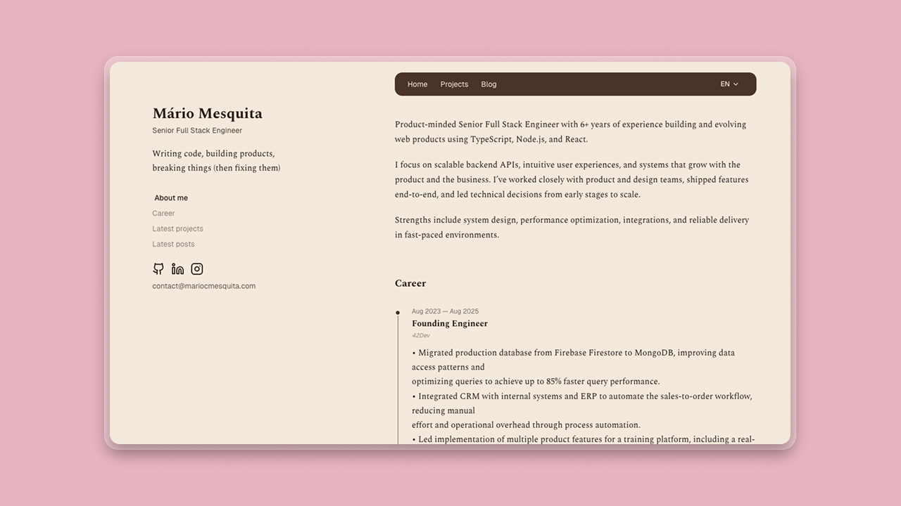

# my-website


A personal website featuring a public portfolio, multilingual blog (EN/PT), and a fully custom admin dashboard for managing content. The backend is a NestJS REST API; the frontend is Next.js App Router with server components and React Query. Everything is self-hosted on a VPS via Docker Compose and Nginx.

Live site: **[mariocmesquita.com](https://mariocmesquita.com)**

---

## Screenshots



---

## Why I Built This

I wanted a personal website that went beyond a static page — something with a real CMS, multilingual support, and full ownership over the stack. Instead of reaching for a headless CMS or a blog platform, I built everything from scratch: a NestJS API, a Next.js frontend with SSR, a TipTap rich-text editor, Firebase auth, and automated deploys to a VPS. The goal was to have a place to show who I am — my career, my projects, and a blog to write about ideas, technical topics, and whatever else I feel like sharing. Owning the entire stack means I can grow it in whatever direction I want, adding features as I need them.

---

## Features

- **Multilingual portfolio & blog** — Public pages with EN/PT language switching via `next-intl`, with locale-prefixed URLs
- **Custom admin dashboard** — Protected by Firebase Authentication, with full CRUD for profile, career, projects, and posts
- **Rich-text editor** — TipTap WYSIWYG editor for writing and formatting blog posts
- **Per-entity translations** — Dedicated translation management (EN + PT) for profile, career, projects, and posts
- **Security & error logging** — Dashboard view for auth failures, rate limit hits, and internal errors
- **Self-hosted deployment** — Docker Compose + Nginx reverse proxy on a VPS
- **CI/CD pipeline** — GitHub Actions: lint, type-check, build, push to GHCR, deploy over SSH

## Tech Stack

| Frontend                     | Backend                 |
| ---------------------------- | ----------------------- |
| Next.js 16, React 19         | NestJS 11               |
| Tailwind CSS 4, shadcn/ui    | Prisma 7, PostgreSQL 17 |
| next-intl (i18n)             | Firebase Admin SDK      |
| React Query, react-hook-form | Zod validation          |
| TipTap editor                | UUIDv7                  |
| iron-session                 | Docker Compose          |

## Architecture

This project is a **pnpm monorepo** managed by Turborepo with two apps and shared packages.

```
┌───────────────────────────────────────────────────────────────┐
│                          Monorepo                             │
│                                                               │
│  ┌────────────────┐          ┌──────────────────────────────┐ │
│  │   apps/web     │  HTTP    │         apps/api             │ │
│  │   (Next.js)    │ ───────► │    (NestJS REST API)         │ │
│  │                │          │                              │ │
│  │  — App Router  │          │  — Firebase Auth guard       │ │
│  │  — React Query │          │  — Zod validation            │ │
│  │  — shadcn/ui   │          │  — Prisma ORM                │ │
│  │  — next-intl   │          │  — Security logging          │ │
│  └───────┬────────┘          └─────────────┬────────────────┘ │
│          │                                 │                  │
│          └───────────┬─────────────────────┘                  │
│                      │                                        │
│           ┌──────────▼──────────┐                             │
│           │      packages/      │                             │
│           │                     │                             │
│           │  — env (validation) │                             │
│           │  — schemas (Zod)    │                             │
│           │  — shared configs   │                             │
│           └─────────────────────┘                             │
└───────────────────────────────────────────────────────────────┘
```

### Key design decisions

**Thin Cookie Bridge auth**
Firebase Client SDK handles sign-in, then posts the token to a Next.js API route that creates an httpOnly cookie via `iron-session`. The `proxy.ts` middleware verifies the session on every request. API calls use `Authorization: Bearer <firebase-id-token>`.

**Shared Zod schemas (`@my-website/schemas`)**
Validation schemas for all entities live in one package and are imported by both apps — ensuring the API and frontend always agree on data shapes.

**Typed environment variables (`@my-website/env`)**
A shared package validates all env vars with `@t3-oss/env-nextjs` at startup. Missing or malformed vars fail fast with a clear error.

### Deploy flow

```
┌────────────┐     ┌─────────────────────────┐     ┌──────────────────┐
│  git push  │ ──► │  GitHub Actions         │ ──► │  Docker build +  │
│  main      │     │  (lint + type-check)    │     │  push to GHCR    │
└────────────┘     └─────────────────────────┘     └────────┬─────────┘
                                                            │
                                                            ▼
                                                   ┌──────────────────┐
                                                   │  SSH into VPS    │
                                                   │  docker compose  │
                                                   │  pull + up       │
                                                   └──────────────────┘
```

## Project Structure

```
.
├── apps/
│   ├── api/            NestJS — modules, Prisma, guards, filters
│   └── web/            Next.js — app router, components, hooks, http, server
├── packages/
│   ├── env/
│   ├── schemas/
│   ├── typescript-config/
│   ├── eslint-config/
│   └── prettier-config/
├── docker-compose.yml
├── nginx/
└── turbo.json
```

## Running Locally

### Prerequisites

- [Node.js 18+](https://nodejs.org/)
- [pnpm 9+](https://pnpm.io/)
- PostgreSQL 17+ (or Docker)
- A Firebase project with Authentication enabled and a service account key for the Admin SDK

```bash
cp .env.example .env   # fill in the values
pnpm install
docker compose up -d postgres
pnpm dev
```

To run the API in isolation:

```bash
pnpm --filter api run dev
```

To run the web app in isolation:

```bash
pnpm --filter web run dev
```

## Environment Variables

### Database

| Variable            | Description                  | Required |
| ------------------- | ---------------------------- | -------- |
| `DATABASE_URL`      | PostgreSQL connection string | Yes      |
| `POSTGRES_DB`       | Database name (Docker only)  | Yes      |
| `POSTGRES_USER`     | DB user (Docker only)        | Yes      |
| `POSTGRES_PASSWORD` | DB password (Docker only)    | Yes      |

### Firebase (API — server-side Admin SDK)

| Variable                | Description                  | Required |
| ----------------------- | ---------------------------- | -------- |
| `FIREBASE_PROJECT_ID`   | Firebase project ID          | Yes      |
| `FIREBASE_CLIENT_EMAIL` | Service account client email | Yes      |
| `FIREBASE_PRIVATE_KEY`  | Service account private key  | Yes      |

### Firebase (Web — client SDK)

| Variable                                   | Description             | Required |
| ------------------------------------------ | ----------------------- | -------- |
| `NEXT_PUBLIC_FIREBASE_API_KEY`             | Firebase web API key    | Yes      |
| `NEXT_PUBLIC_FIREBASE_AUTH_DOMAIN`         | Firebase auth domain    | Yes      |
| `NEXT_PUBLIC_FIREBASE_PROJECT_ID`          | Firebase project ID     | Yes      |
| `NEXT_PUBLIC_FIREBASE_STORAGE_BUCKET`      | Firebase Storage bucket | Yes      |
| `NEXT_PUBLIC_FIREBASE_MESSAGING_SENDER_ID` | Messaging sender ID     | Yes      |
| `NEXT_PUBLIC_FIREBASE_APP_ID`              | Firebase app ID         | Yes      |

### Session & Misc

| Variable              | Description                                          | Required                    |
| --------------------- | ---------------------------------------------------- | --------------------------- |
| `SESSION_SECRET`      | iron-session secret (min 32 chars)                   | Yes                         |
| `NEXT_PUBLIC_API_URL` | Public URL of the API (e.g. `http://localhost:3001`) | Yes                         |
| `SERVER_PORT`         | API port                                             | No (default: `3001`)        |
| `NODE_ENV`            | `development` \| `production`                        | No (default: `development`) |
| `IMAGE_OWNER`         | GitHub username for GHCR image path (Docker only)    | Yes (prod)                  |
